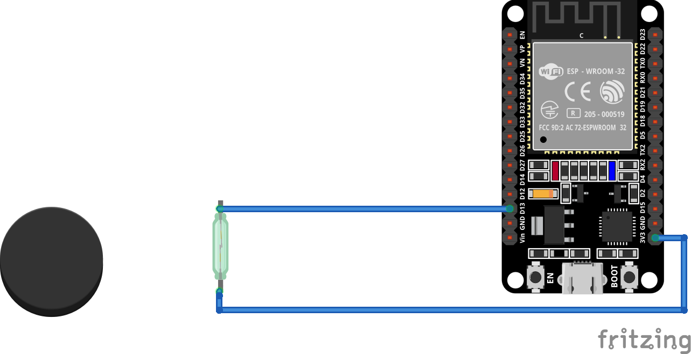
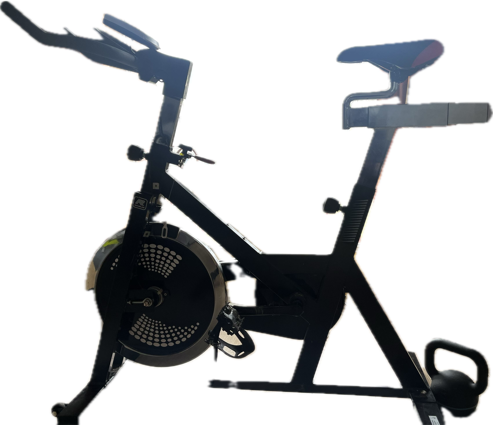
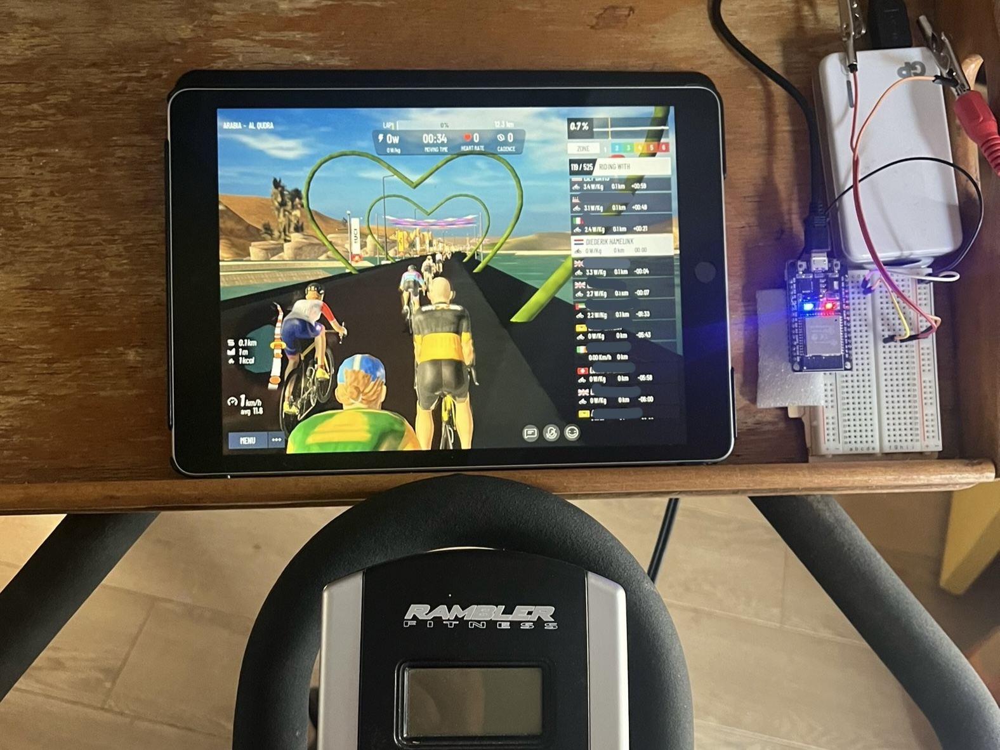

# BLE Cycle Power for any Spinning Bike
ESP32 arduino sketch to create an BLE Cycle Power sensor from a spin bike with just a wheel sensor, using fake/approximate power calculations.

This sketch creates a (virtual) BLE Power Sensor from a simple wheel sensor.
By using an fixed amount of energy per wheel revolution we calculate the Power in watts and broadcast it over BLE.
Feel free to improve the calculations, this was working good enough for me. ;-), but try to keep it realistic, otherwise it's no fun! ;-)


[](#)

### Hardware
I've tested it on an ESP32 board (2AC7Z-ESPWROOM32) with the wheel sensor on an secondhand Rambler spinning bike.
It works with apps like myWoosh.

### Power Calculations
This version is working for me, but the power calculation may need some improvement.

### Deep sleep / power save mode:
This program will put the ESP32 into deep sleep mode when the wheel sensor is idle over 180 seconds (SLEEP_AFTER_MILLIS).
Sensing any change on the wheel sensor will wake-up the ESP32 from deep sleep.

### Config:
Change these values to what you need and you're good to go:
```
/*
 * Settings:
 */

/* Device name which can be seen in BLE scanning software. */
#define BLE_DEVICE_NAME               "Diederik's bike"

/* Local name which should pop up when scanning for BLE devices. */
#define BLE_LOCAL_NAME                "Cycle Power BLE"

/* BLE pairing LED indicator  */
#define PIN_LED GPIO_NUM_2            // GPIO_NUM_2 is an onboard LED on my ESP32WROOM

/* GPIO INPUT + RTC for wakeup */
#define PIN_WHEEL_SENSOR GPIO_NUM_13  // I am using GPIO_NUM_13, 3rd pin on EN btn side.

/* Deep sleep idle timeout in milliseconds */
#define SLEEP_AFTER_MILLIS 180 * 1000 // 180 * 1000 = 3 minutes.


```


### My Setup

[](#)
My Rambler Bike with default wheel sensor, connected using a 3.5mm mini jack.

[](#)
Using MyWoosh, note: I am using a seperate BLE cadense and heartrate monitor.

